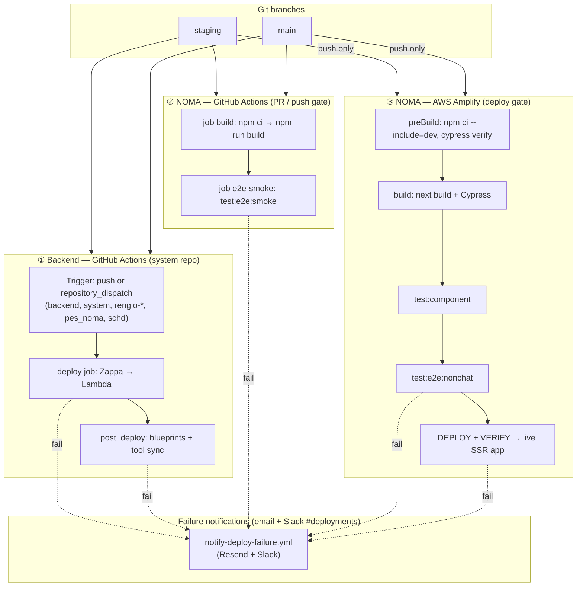
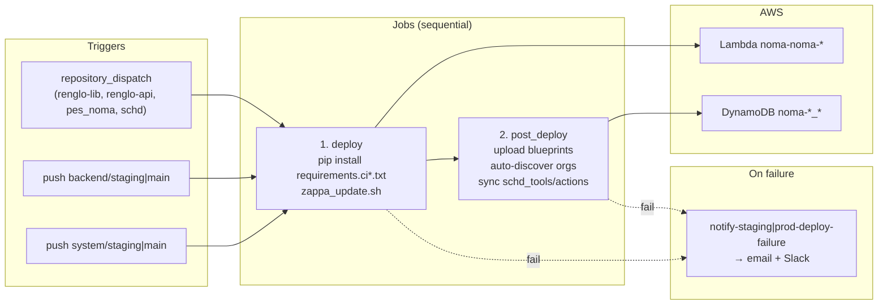
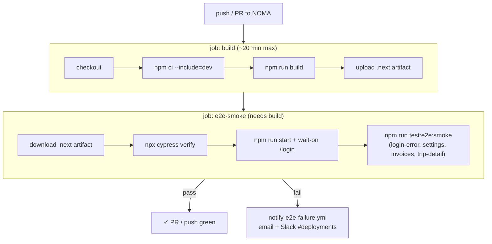
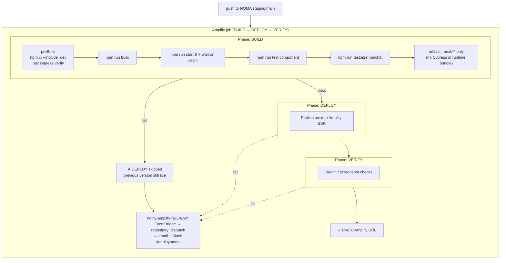
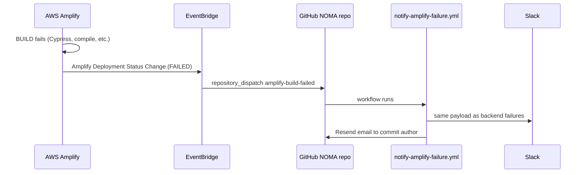
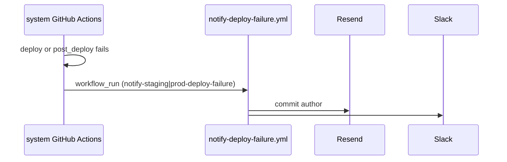
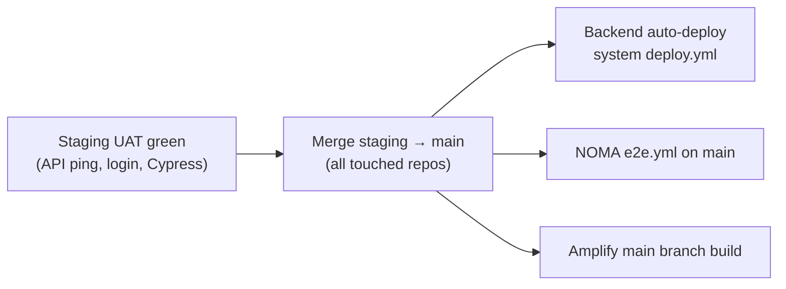

# NOMA CI/CD — End-to-End Flow

Reference for developers: how code moves from Git branches to staging/production, where tests run, and what happens on failure.

**Related docs:** [`STAGING_GUIDE.md`](STAGING_GUIDE.md) · [`DEPLOYMENT_GUIDE.md`](DEPLOYMENT_GUIDE.md) · [`NOMA/cypress/DEPLOY_CI.md`](../NOMA/cypress/DEPLOY_CI.md)

---

## At a glance — two independent pipelines

Backend and frontend use **different CI systems**. A push to `NOMA/staging` runs **both** paths below in parallel; they do not block each other.



| Track | Runs on | Deploys? | Blocks live app if red? |
|-------|---------|----------|-------------------------|
| ① Backend | `system` GitHub Actions | Lambda + API GW | Yes — Lambda not updated / post_deploy fails |
| ② NOMA GitHub `e2e.yml` | `NOMA` GitHub Actions | **No** — test gate only | No — but PR/push is red; notify fires |
| ③ NOMA Amplify | AWS Amplify Hosting | **Yes** — `.next` SSR | Yes — BUILD fail = no DEPLOY; prior version stays live |

---

## Branch → environment map

| Branch | Backend Lambda | Frontend URL | Dependency refs |
|--------|----------------|--------------|-----------------|
| `staging` | `noma-noma-staging` | `staging.d1f1y2ixvuy9lc.amplifyapp.com` | `requirements.ci.staging.txt` → `@staging` |
| `main` | `noma-noma-prod` | `app.travelwithnoma.com` | `requirements.ci.txt` → `@main` |

**Promotion:** merge `staging` → `main` across affected repos after UAT, then both environments redeploy automatically.

---

## ① Backend pipeline (detail)

**Repo:** `Noma-Travel/system`  
**Workflows:** `deploy-staging.yml` / `deploy.yml` (+ reusable `deploy-backend-reusable.yml`, `post-deploy-reusable.yml`)



**Concurrency:** `deploy-staging` and `deploy-production` groups — one deploy at a time per environment.

**Cross-repo dispatch:** `backend`, `renglo-lib`, `renglo-api`, `pes_noma`, `schd` use `SYSTEM_REPO_PAT` (Contents **read+write** on `system`) to fire `repository_dispatch`.

---

## ② NOMA — GitHub Actions (`e2e.yml`)

**Purpose:** Fast feedback on PRs and pushes. **Does not deploy** the app.

**Trigger:** push or PR to `staging`, `main`, or `develop`



| Step | Command / action | What it catches |
|------|------------------|-----------------|
| build | `npm run build` | TypeScript / compile errors |
| e2e-smoke | `test:e2e:smoke` | Deterministic Cypress specs (no live LLM) |

**Workflow file:** [`NOMA/.github/workflows/e2e.yml`](../NOMA/.github/workflows/e2e.yml)  
**Notify workflow:** [`NOMA/.github/workflows/notify-e2e-failure.yml`](../NOMA/.github/workflows/notify-e2e-failure.yml)

---

## ③ NOMA — AWS Amplify (deploy pipeline)

**Purpose:** Build, test, and **deploy** the SSR app. Runs on **push** to `staging` or `main` (not on PRs).

**Config:** [`NOMA/amplify.yml`](../NOMA/amplify.yml)  
**Note:** WEB_COMPUTE (Next.js SSR) ignores Amplify’s separate `test:` phase — Cypress runs inside the **build** phase.



| Step | Script | Specs / scope |
|------|--------|----------------|
| test:component | `cypress run --component` | UI component tests |
| test:e2e:nonchat | auth, crud, trips, settings | Full non-chat E2E (deploy gate) |
| test:e2e:smoke | *(GitHub only)* | Subset — see track ② |

**If BUILD fails** (including Cypress): Amplify stops the job; **DEPLOY never runs**; users keep the last successful deployment.

---

## Deploy notifications (success + failure)

All notifications flow through one reusable workflow: [`notify-deploy.yml`](.github/workflows/notify-deploy.yml)
(`outcome: success|failure`, `alert_type: deploy|ci_gate`). **Slack `#deployments`** always;
**Resend email** to the commit author on failure only. Branch is resolved from the source
event (`workflow_run.head_branch` / `client_payload.branch`), not `GITHUB_REF_NAME`, so
staging alerts correctly show `staging`. On failure the workflow uses `GH_PAT` to pull the
failed run's jobs + log lines into the message.

| Source | Outcome | Workflow | Trigger |
|--------|---------|----------|---------|
| GitHub `e2e.yml` (build-and-e2e-smoke) | failure | `NOMA/notify-e2e-failure.yml` (`alert_type: ci_gate`) | `workflow_run` on "Build and E2E" |
| Amplify deploy | failure | `NOMA/notify-amplify-failure.yml` | EventBridge `SUCCEED`/`FAILED` → Lambda → `amplify-build-failed` |
| Amplify deploy | success | `NOMA/notify-amplify-success.yml` | EventBridge → Lambda → `amplify-build-succeeded` |
| Backend Zappa / post_deploy | failure | `system/notify-*-deploy-failure.yml` | `workflow_run` on deploy workflow |
| Backend Zappa / post_deploy | success | `system/notify-*-deploy-success.yml` | `workflow_run` on deploy workflow |

`notify-deploy-failure.yml` is kept as a thin backward-compatible wrapper that calls
`notify-deploy.yml` with `outcome: failure`.

The Amplify Lambda ([`lambda/amplify_github_notify/handler.py`](lambda/amplify_github_notify/handler.py))
now dispatches both `amplify-build-failed` (FAILED) and `amplify-build-succeeded` (SUCCEED);
re-run [`scripts/setup_amplify_github_notify.py`](scripts/setup_amplify_github_notify.py) to
update the EventBridge pattern (`jobStatus: ["FAILED", "SUCCEED"]`) and Lambda code.

### Amplify → GitHub notify wiring

Amplify builds do not run inside GitHub Actions, so a small AWS hook bridges failures into the same notify workflow:



**Dispatch payload example** (Lambda posts to GitHub API):

```json
{
  "event_type": "amplify-build-failed",
  "client_payload": {
    "environment_label": "staging",
    "branch": "staging",
    "job_id": "6",
    "sha": "…",
    "commit_message": "…",
    "commit_author_email": "…",
    "triggered_by": "github-login",
    "source_repo": "Noma-Travel/NOMA",
    "run_url": "https://us-east-1.console.aws.amazon.com/amplify/home?region=us-east-1#d1f1y2ixvuy9lc/staging/6"
  }
}
```

### One-time AWS wiring (EventBridge → Lambda → GitHub)

Infra lives in [`system/lambda/amplify_github_notify/handler.py`](lambda/amplify_github_notify/handler.py) and [`system/scripts/setup_amplify_github_notify.py`](scripts/setup_amplify_github_notify.py).

| Resource | Name |
|----------|------|
| EventBridge rule | `noma-amplify-build-failed` — `aws.amplify` / `Amplify Deployment Status Change` / `jobStatus: FAILED` / app `d1f1y2ixvuy9lc` |
| Lambda | `noma-amplify-github-notify` |
| Secrets Manager | `noma/amplify-github-notify` — JSON `{"GITHUB_TOKEN": "<same as NOMA GH_PAT>"}` |
| GitHub target | `POST /repos/Noma-Travel/NOMA/dispatches` → `notify-amplify-failure.yml` |

```bash
cd system
# Use the same PAT stored as NOMA repo secret GH_PAT (needs repo + workflow scope)
python scripts/setup_amplify_github_notify.py --profile noma --github-token "$GITHUB_TOKEN"

# Smoke-test without waiting for a failed Amplify build:
python scripts/setup_amplify_github_notify.py --test-dispatch --github-token "$GITHUB_TOKEN"
```

After `--test-dispatch`, open [NOMA Actions](https://github.com/Noma-Travel/NOMA/actions/workflows/notify-amplify-failure.yml) — you should see a run and Slack/email (if secrets are set on NOMA).

Branch → `environment_label`: `staging` → `staging (NOMA Amplify)`, `main` → `prod (NOMA Amplify)`.

---

## Backend failure notifications (reference)



**Reusable workflow:** [`system/.github/workflows/notify-deploy-failure.yml`](.github/workflows/notify-deploy-failure.yml)

---

## Production promotion



After promotion: `GET …/noma_prod/ping` → `{"pong":true}`, spot-check prod app, confirm `requirements.ci.txt` in deploy logs.

---

## Environment URLs

| | Staging | Production |
|---|---------|------------|
| REST API | `https://2r4dlx8qdj.execute-api.us-east-1.amazonaws.com/noma_staging` | `https://u8za3vvgbb.execute-api.us-east-1.amazonaws.com/noma_prod` |
| WebSocket | `wss://1qefn6vt95.execute-api.us-east-1.amazonaws.com/production` | `wss://3vdnaldxj0.execute-api.us-east-1.amazonaws.com/production` |
| NOMA app | `https://staging.d1f1y2ixvuy9lc.amplifyapp.com` | `https://app.travelwithnoma.com` |
| Lambda | `noma-noma-staging` | `noma-noma-prod` |
| DynamoDB | `noma-staging_*` | `noma-prod_*` |
| Cognito | `us-east-1_vBbXLDESt` | (prod pool — see Zappa settings) |

---

## Secrets checklist

| Secret | `system` | `NOMA` | Purpose |
|--------|----------|--------|---------|
| `SYSTEM_REPO_PAT` | — | — | On backend, renglo-*, pes_noma, schd |
| `ZAPPA_SETTINGS` / `ZAPPA_SETTINGS_STAGING` | ✓ | — | Lambda env |
| `AWS_ACCESS_KEY_ID` / `AWS_SECRET_ACCESS_KEY` | ✓ | — | Deploy |
| `GH_PAT` | ✓ | ✓ | Private checkouts + author lookup |
| `RESEND_API_KEY` / `DEPLOY_ALERT_FROM` | ✓ | ✓ | Failure email |
| `SLACK_DEPLOY_TEAM_WEBHOOK_URL` | ✓ | ✓ | `#deployments` |
| `USER_EMAIL_MAP` | ✓ | ✓ | noreply → real email |
| `CYPRESS_*` / `NEXT_PUBLIC_*` | — | ✓ | Build + E2E |

---

## Troubleshooting

| Symptom | Likely cause | Fix |
|---------|--------------|-----|
| Amplify BUILD fails on Cypress | WEB_COMPUTE ignores `test:` phase | Tests in **build** phase — [`amplify.yml`](../NOMA/amplify.yml) |
| No Slack on Amplify fail | EventBridge/Lambda misconfigured or wrong `GITHUB_TOKEN` in Secrets Manager | Re-run `setup_amplify_github_notify.py`; see § Amplify → GitHub notify wiring |
| No Slack on `e2e.yml` fail | Secrets missing on `NOMA` | Copy from `system`; enable `notify-e2e-failure.yml` |
| `e2e-smoke` passes but Amplify fails | Different suites (smoke ⊂ nonchat) | Check Amplify BUILD log for failing spec |
| Chat WebSocket HTTP 500 | Missing `$connect` MOCK responses | Launcher `create_websocket_api.py` |
| post_deploy finds 0 orgs | No orgs in staging DynamoDB | Complete onboarding on staging NOMA |
| CORS / Failed to fetch on staging | `FE_BASE_URL` / Amplify org env vars | [`STAGING_GUIDE.md`](STAGING_GUIDE.md) Step 8 |
