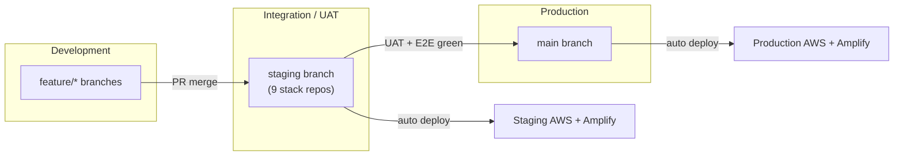
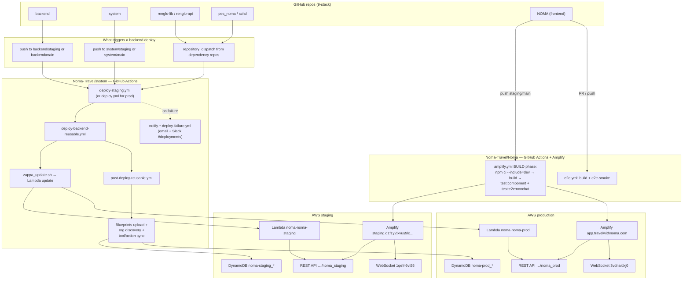
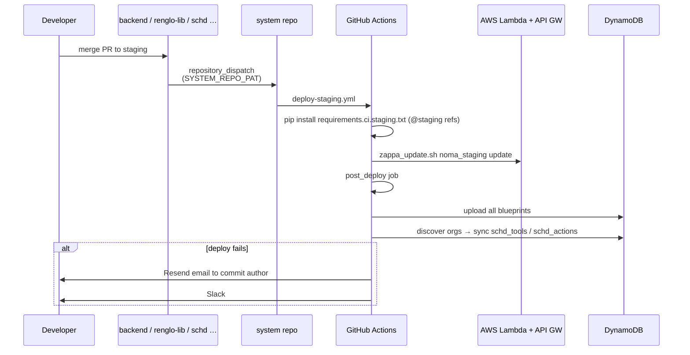
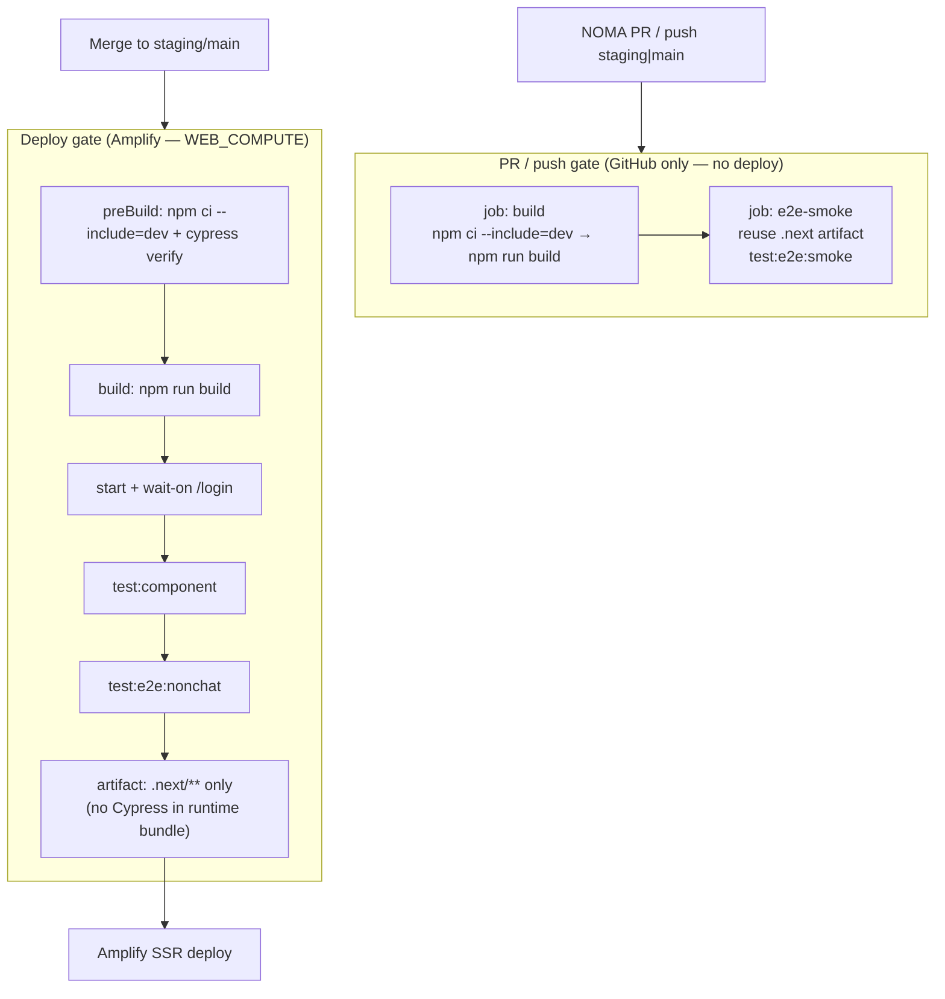
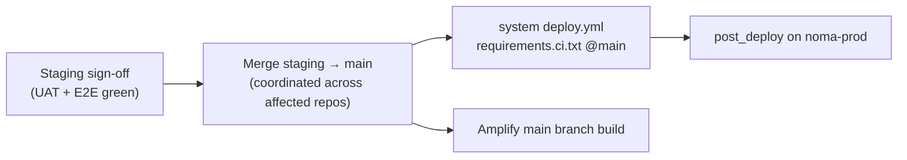

# NOMA CI/CD — End-to-End Flow

Reference diagram for developers: how code moves from Git branches to staging/production, and where tests and notifications run.

**Related docs:** [`STAGING_GUIDE.md`](STAGING_GUIDE.md) · [`DEPLOYMENT_GUIDE.md`](DEPLOYMENT_GUIDE.md) · [`NOMA/cypress/DEPLOY_CI.md`](../NOMA/cypress/DEPLOY_CI.md)

---

## Branch model

| Branch | Backend Lambda | Frontend | pip/git refs |
|--------|----------------|----------|--------------|
| `staging` | `noma-noma-staging` | Amplify branch `staging` | `requirements.ci.staging.txt` → `@staging` |
| `main` | `noma-noma-prod` | Amplify branch `main` | `requirements.ci.txt` → `@main` |

---

## Full pipeline (all repos)

---

## Backend deploy sequence (staging example)

**Concurrency:** `deploy-staging` and `deploy-production` groups queue overlapping runs (one completes at a time).

**Dependency repos** that dispatch to `system` on push to `staging`/`main`:

- `backend`, `renglo-lib`, `renglo-api`, `pes_noma`, `schd`

Each uses `deploy-trigger-staging.yml` or `deploy-trigger.yml` with secret `SYSTEM_REPO_PAT` (fine-grained PAT: **Contents read+write** on `Noma-Travel/system`).

---

## Frontend deploy & test gates

| Suite | Runs in Amplify BUILD | Runs in GitHub e2e.yml | Manual |
|-------|----------------------|------------------------|--------|
| Component tests | Yes | No | `npm run test:component` |
| Non-chat E2E | Yes | No | `npm run test:e2e:nonchat` |
| Smoke E2E | No | Yes | `npm run test:e2e:smoke` |
| Chat / agent E2E | No | No | `npm run test:e2e:chat` (LLM-dependent) |

---

## Production promotion

After promotion, verify prod ping (`GET …/noma_prod/ping`), a quick spot-check on the prod app, and `requirements.ci.txt` in deploy logs.

---

## Environment map (quick reference)

| | Staging | Production |
|---|---------|------------|
| REST API | `https://2r4dlx8qdj.execute-api.us-east-1.amazonaws.com/noma_staging` | `https://u8za3vvgbb.execute-api.us-east-1.amazonaws.com/noma_prod` |
| WebSocket | `wss://1qefn6vt95.execute-api.us-east-1.amazonaws.com/production` | `wss://3vdnaldxj0.execute-api.us-east-1.amazonaws.com/production` |
| NOMA URL | `https://staging.d1f1y2ixvuy9lc.amplifyapp.com` | `https://app.travelwithnoma.com` |
| Lambda | `noma-noma-staging` | `noma-noma-prod` |
| DynamoDB prefix | `noma-staging_*` | `noma-prod_*` |
| Cognito pool | `us-east-1_vBbXLDESt` | (prod pool — see Zappa settings) |

---

## Secrets checklist (operators)

| Secret | Where | Purpose |
|--------|-------|---------|
| `SYSTEM_REPO_PAT` | backend, renglo-*, pes_noma, schd | Cross-repo `repository_dispatch` |
| `ZAPPA_SETTINGS` / `ZAPPA_SETTINGS_STAGING` | system | Lambda env + Zappa config JSON |
| `AWS_ACCESS_KEY_ID` / `AWS_SECRET_ACCESS_KEY` | system | Deploy + post_deploy |
| `GH_PAT` | system | Checkout private repos in CI |
| `RESEND_API_KEY` / `SLACK_DEPLOY_WEBHOOK_URL` | system | Failure notifications |
| `CYPRESS_*` / `NEXT_PUBLIC_*` | NOMA (GitHub + Amplify) | E2E and build-time env |

---

## Troubleshooting pointers

| Symptom | Likely cause | Doc / fix |
|---------|--------------|-----------|
| Amplify BUILD fails on Cypress | devDeps skipped or WEB_COMPUTE ignores `test:` phase | [`NOMA/amplify.yml`](../NOMA/amplify.yml) — tests in **build** phase |
| Chat WebSocket HTTP 500 on connect | Missing `$connect` route/integration responses on MOCK API | `system/scripts/fix_staging_ws_connect.py` or launcher `create_websocket_api.py` |
| `Failed to fetch` after staging login | CORS / `FE_BASE_URL` mismatch or prod org IDs on Amplify **All branches** | [`STAGING_GUIDE.md`](STAGING_GUIDE.md) Step 8 |
| post_deploy finds 0 orgs | No orgs in staging DynamoDB yet | Complete onboarding on staging NOMA first |
| Deploy notify workflow 0s / skipped | Invalid `secrets.*` in workflow `if:` | Fixed in `notify-deploy-failure.yml` (2026-06-09) |
