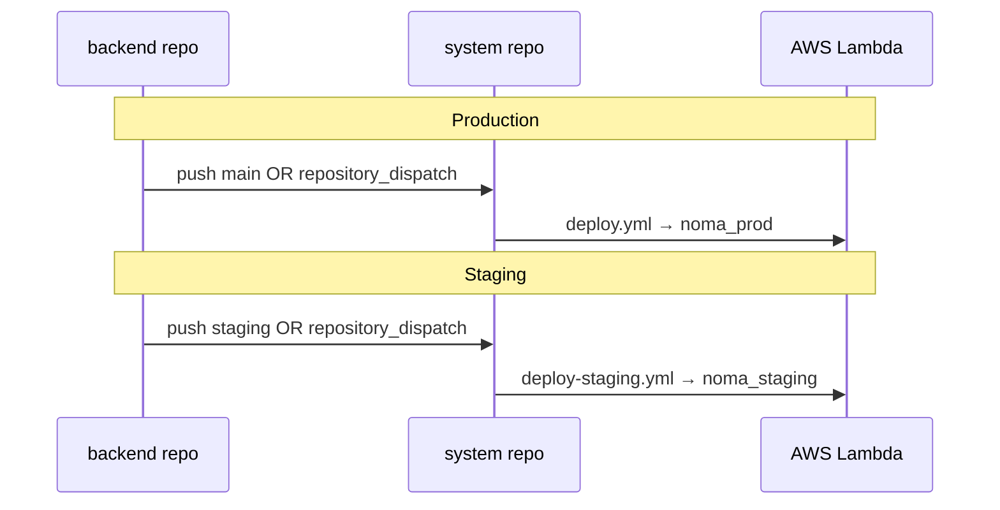

# Staging Environment — Branch Policy and Setup

This document describes the **`staging` branch** strategy across the NOMA stack. Staging branches were created to mirror production (`main`) while allowing integration and UAT before production releases.

---

## Repositories with `staging` branch

| Repository | GitHub | Purpose |
|------------|--------|---------|
| `renglo-lib` | [Noma-Travel/renglo-lib](https://github.com/Noma-Travel/renglo-lib) | Lambda dependency (`@staging`) |
| `renglo-api` | [Noma-Travel/renglo-api](https://github.com/Noma-Travel/renglo-api) | Lambda dependency (`@staging`) |
| `system` | [Noma-Travel/system](https://github.com/Noma-Travel/system) | Zappa deploy orchestrator |
| `console` | [Noma-Travel/console](https://github.com/Noma-Travel/console) | Local dev admin UI (not Amplify-deployed) |
| `backend` | [Noma-Travel/backend](https://github.com/Noma-Travel/backend) | Handlers package (`@staging`) |
| `NOMA` | [Noma-Travel/Noma](https://github.com/Noma-Travel/Noma) | App frontend (Amplify `staging`) |
| `pes_noma` | [Noma-Travel/pes_noma](https://github.com/Noma-Travel/pes_noma) | Lambda dependency (`@staging`) |
| `wss` | [Noma-Travel/wss](https://github.com/Noma-Travel/wss) | WebSocket service |
| `schd` | [Noma-Travel/schd](https://github.com/Noma-Travel/schd) | Scheduler extension (`@staging`) |

**Initial state:** Each `staging` branch was created from the current `main` tip (same commit SHA). They will diverge as work lands on `staging` first.

---

## Branch workflow

```
feature/*  ──PR──►  staging  ──UAT/E2E──►  main
                      │                      │
                      ▼                      ▼
               staging deploy           production deploy
```

| Branch | Deploys to | Typical use |
|--------|------------|-------------|
| `staging` | Staging stack (`noma_staging`, staging Amplify URL, etc.) | Integration, UAT, E2E |
| `main` | Production (`noma_prod`, production Amplify URL) | Release after staging validation |

### Day-to-day

1. Open PRs targeting **`staging`** (not `main`) for new features.
2. After merge, staging CI/CD deploys automatically (once workflows from Step 3+ are in place).
3. Run UAT/E2E against staging URLs.
4. Promote to production by merging **`staging` → `main`** across affected repos (coordinated release).

### Keeping branches aligned

- Periodically merge `main` → `staging` if hotfixes land on production first.
- Before a production release, ensure `staging` has been validated and is ready to merge into `main`.

---

## Local checkout

```bash
git fetch origin
git checkout staging
git pull origin staging
```

---

## Branch protection (recommended — configure in GitHub)

Branch protection cannot be fully automated without org admin rights. Configure in **GitHub → Repository → Settings → Branches** for each repo above.

### `staging`

- Require a pull request before merging
- 1 approving review (optional for fast iteration teams)
- Do not allow force pushes
- Allow administrators to bypass (optional during bootstrap)

### `main`

- Require a pull request before merging
- 1–2 approving reviews
- Require branches to be up to date
- Do not allow force pushes
- Restrict who can push (release managers only, optional)

### NOMA-specific (after Step 1 CI)

On `develop` / `staging` / `main`, optionally require status checks:

- `build`
- `e2e-smoke`

---

## Deploy triggers (configured)

Pushes to `staging` or `main` in dependency repos dispatch deploys to the **system** repo.

| Source repo | `staging` push | `main` push |
|-------------|----------------|-------------|
| `backend` | `backend-staging-updated` → `deploy-staging.yml` | `backend-main-updated` → `deploy.yml` |
| `renglo-lib` | `renglo-lib-staging-updated` | `renglo-lib-main-updated` |
| `renglo-api` | `renglo-api-staging-updated` | `renglo-api-main-updated` |
| `pes_noma` | `pes-noma-staging-updated` | `pes-noma-main-updated` |
| `schd` | `schd-staging-updated` | `schd-main-updated` |
| `system` | direct `deploy-staging.yml` | direct `deploy.yml` |

- Staging installs from [`requirements.ci.staging.txt`](requirements.ci.staging.txt) (`@staging` git refs).
- Production installs from [`requirements.ci.txt`](requirements.ci.txt) (`@main` git refs).
- Concurrency groups `deploy-staging` and `deploy-production` queue overlapping runs.

### Required GitHub secrets

**`system` repo:** existing `AWS_*`, `GH_PAT`, `ZAPPA_SETTINGS` plus **`ZAPPA_SETTINGS_STAGING`** (staging Lambda config with `noma_staging` stage).

**Post-deploy org sync (step 7c):**

By default, **`post_deploy` discovers all portfolio/org pairs** from DynamoDB (`{env}_entities`) and syncs tools/actions for every org. **No GitHub secret is required.**

Optional override secrets (only if you want to limit sync to a subset, e.g. during debugging):

| Secret | Purpose |
|--------|---------|
| `DEPLOY_SYNC_ORGS` | Optional prod subset — JSON `[{"portfolio":"…","org":"…"}]` |
| `STAGING_SYNC_ORGS` | Optional staging subset — same format |

If the environment has **no orgs yet** (fresh staging), `post_deploy` still uploads blueprints and **skips** tools sync with a log message.

See **Step 7c** below and [`DEPLOYMENT_GUIDE.md`](DEPLOYMENT_GUIDE.md) §9a.

**Each triggering repo** (`backend`, `renglo-lib`, `renglo-api`, `pes_noma`, `schd`): **`SYSTEM_REPO_PAT`** — fine-grained PAT on **`Noma-Travel/system`** with **`Contents: Read and write`** (required for `repository_dispatch`) plus **Metadata: Read**. Actions: Read and write alone is **not** sufficient. Re-paste the token into each repo secret after changing permissions.

## Infrastructure (provisioned 2026-06-08)

Launcher (`deploy_environment.py noma-staging`) created:

| Resource | Value |
|----------|-------|
| DynamoDB tables | `noma-staging_blueprints`, `_entities`, `_rel`, `_chat`, `_data` |
| Cognito User Pool | `us-east-1_vBbXLDESt` |
| Cognito App Client | `6rcfm5lsscs5ocnlu4ftukdbjr` |
| IAM role | `arn:aws:iam::158711196499:role/noma-staging_tt_role` |
| S3 bucket | `noma-staging-42067270` |
| System blueprints | 4 uploaded to `noma-staging_blueprints` |

| Zappa Lambda | `noma-noma-staging` |
| REST API | `https://2r4dlx8qdj.execute-api.us-east-1.amazonaws.com/noma_staging` |
| WebSocket API | `wss://1qefn6vt95.execute-api.us-east-1.amazonaws.com/production` |
| Backend `WEBSOCKET_CONNECTIONS` | `https://1qefn6vt95.execute-api.us-east-1.amazonaws.com/production` |
| NOMA Amplify staging | `https://staging.d1f1y2ixvuy9lc.amplifyapp.com` (branch overrides in Amplify Console) |

**Console (`console` repo):** local developer tool only — run with `npm run dev` and `.env.development` / `.env.production` pointing at the API you are debugging. **Not** deployed via Amplify (no staging branch or app).

**Step 7c (post-deploy):** automatic org discovery from DynamoDB — no secrets required.

See also [`DEPLOYMENT_GUIDE.md`](DEPLOYMENT_GUIDE.md) for production deploy flow.

---

## Step 7c — Post-deploy org sync (automatic)

After each Zappa deploy, **`post_deploy`**:

1. Uploads **all** blueprints to `{env}_blueprints`
2. **Discovers every org** in DynamoDB (`irn:entity:portfolio:*` → orgs under each portfolio)
3. Syncs `schd_tools` / `schd_actions` for each org (`reset` mode)
4. Validates blueprint read-back and tool/action counts

**You do not need `DEPLOY_SYNC_ORGS` or `STAGING_SYNC_ORGS`** unless you want to restrict sync to a subset (optional override).

### Optional secrets (subset override only)

```json
[{"portfolio":"<id>","org":"<id>"}]
```

Use only for debugging or limiting blast radius — not for normal operation.

### Fresh staging (zero orgs)

Until someone signs up on staging NOMA, discovery finds 0 orgs: blueprints still upload; tools sync is skipped (success).

**Blueprint upload scope:** `post_deploy` uploads JSON from `backend/blueprints` plus every sibling extension `*/blueprints` (`schd`, `pes_noma`, `claw`, `inca`, …). CI checks out those repos next to `backend/` so rings like `schd_tools` are defined before org onboarding.

### Local manual run (one org)

```bash
python C:/Noma/extensions/backend/installer/noma_post_deploy_org.py ^
  --env-file C:/Noma/system/post_deploy.env ^
  --env-name noma-staging ^
  --aws-profile noma --aws-region us-east-1 ^
  --portfolio <ID> --org <ID> --tools-mode reset
```

---

## Step 8 — NOMA frontend staging (Amplify)

Same Amplify app as production; **branch-specific** env vars on branch `staging` (not a second app):

| Variable | Staging value |
|----------|---------------|
| `NEXT_PUBLIC_API_BASE_URL` | `https://2r4dlx8qdj.execute-api.us-east-1.amazonaws.com/noma_staging` |
| `NEXT_PUBLIC_VITE_API_URL` | same |
| `NEXT_PUBLIC_AWS_USER_POOL_ID` | `us-east-1_vBbXLDESt` |
| `NEXT_PUBLIC_AWS_USER_POOL_CLIENT_ID` | `6rcfm5lsscs5ocnlu4ftukdbjr` |
| `NEXT_PUBLIC_VITE_COGNITO_*` | same Cognito IDs |
| `NEXT_PUBLIC_CHAT_WS` | `wss://1qefn6vt95.execute-api.us-east-1.amazonaws.com/production` |

Prod values stay on **All branches** / `main`.

**Do not inherit prod org context on staging:** If `NEXT_PUBLIC_PORTFOLIO_ID` / `NEXT_PUBLIC_ORG_ID` are set under **All branches** (for prod/E2E), they are baked into every branch build unless overridden. First-time staging users will skip portfolio/org onboarding and see `Failed to fetch` on the dashboard. On branch **`staging`**, either **remove** those two variables or set them to **empty** so fresh users are redirected to `/portfolio` → `/organization`. After onboarding, IDs live in `localStorage` only.

**WebSocket note:** the `wss` repo is a **local dev emulator** only. Staging/production chat uses API Gateway WebSocket (`1qefn6vt95`), not a deployed `wss` service.

---

## Verify staging branches exist

```bash
for repo in renglo-lib renglo-api system console backend Noma pes_noma wss schd; do
  echo -n "$repo: "
  git ls-remote --heads "https://github.com/Noma-Travel/${repo}.git" staging
done
```

---

## `ZAPPA_SETTINGS_STAGING` secret (Step 7b — do now)

**When:** After launcher (done) and before first staging deploy test. Template file: **`zappa_settings_staging.json`** (gitignored, filled locally).

**Action:** Refresh GitHub secret **`ZAPPA_SETTINGS_STAGING`** whenever `zappa_settings_staging.json` changes locally.

| Field | Staging value |
|-------|---------------|
| `API_GATEWAY_ARN` | `arn:aws:execute-api:us-east-1:158711196499:2r4dlx8qdj` |
| `BASE_URL` / `DOC_BASE_URL` | `https://2r4dlx8qdj.execute-api.us-east-1.amazonaws.com/noma_staging` |
| `WEBSOCKET_CONNECTIONS` | `https://1qefn6vt95.execute-api.us-east-1.amazonaws.com/production` |

Update `FE_BASE_URL` / `CORS_ALLOWED_ORIGINS` in `ZAPPA_SETTINGS_STAGING` if your NOMA Amplify staging URL differs from `staging.d1f1y2ixvuy9lc.amplifyapp.com` (Amplify app id `d1f1y2ixvuy9lc`). A mismatch causes browser `Failed to fetch` on `/_auth/tree` and blocks onboarding.

## Minimum deploy triggers (system + backend)

Your required behavior is already configured:

| Commit to | Repo | What runs |
|-----------|------|-----------|
| `main` | **system** | `deploy.yml` → `noma_prod` |
| `staging` | **system** | `deploy-staging.yml` → `noma_staging` |
| `main` | **backend** | `deploy-trigger.yml` → dispatches **system** `deploy.yml` |
| `staging` | **backend** | `deploy-trigger-staging.yml` → dispatches **system** `deploy-staging.yml` |

Pushes to `main`/`staging` in **renglo-lib**, **renglo-api**, **pes_noma**, and **schd** also trigger the same system deploys (optional extra triggers). Concurrency groups prevent overlapping production or staging deploys from running at once.



## Changelog

| Date | Action |
|------|--------|
| 2026-06-08 | Created `staging` branch on all 9 stack repos from `main` |
| 2026-06-08 | Added `deploy-staging.yml`, `requirements.ci.staging.txt`, and cross-repo dispatch triggers |
| 2026-06-08 | Added `zappa_settings_staging.json` template for `ZAPPA_SETTINGS_STAGING` secret |
| 2026-06-08 | First `deploy-staging.yml` CI deploy; Lambda `noma-noma-staging` live |
| 2026-06-08 | Staging WebSocket API `noma_staging_websocket` (`1qefn6vt95`); NOMA Amplify staging connected |
| 2026-06-08 | Step 7c: post_deploy enabled; DEPLOY_SYNC_ORGS / STAGING_SYNC_ORGS documented |
