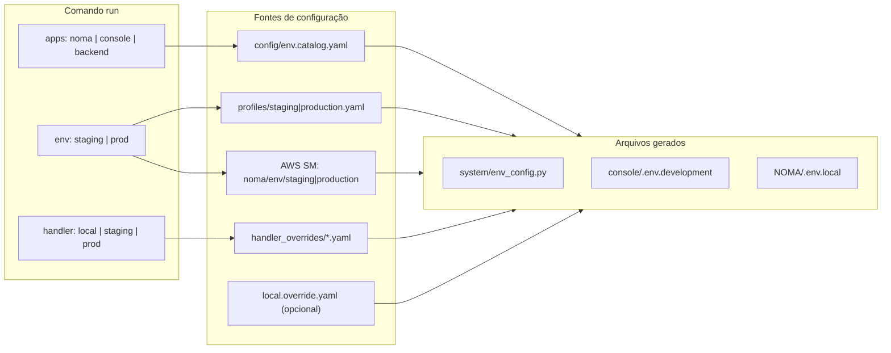

# Guia do desenvolvedor — ambiente Noma (`run`)

Documento de referência para **devs novos e veteranos**. Substitui o fluxo antigo de copiar `.env` e `env_config.py` pelo chat.

**Resumo:** um comando gera toda a configuração local e sobe os apps que você escolher.

---

## Início rápido (5 minutos)

### 1. Pré-requisitos

| Item | Como verificar |
|------|----------------|
| Repositórios clonados | `system`, `console`, `NOMA`, `renglo-api`, `renglo-lib`, `backend` (extensão), `wss` (extensão) |
| Python 3.12 + venv em `system/venv` | `C:\Noma\system\venv\Scripts\python.exe --version` |
| venv do WSS em `wss/wss-venv` | `C:\Noma\extensions\wss\wss-venv\Scripts\python.exe --version` (ver README do `wss`) |
| Node.js | `node --version` |
| AWS CLI profile `noma` | `aws configure list-profiles` |
| Acesso ao Secrets Manager | `aws sso login --profile noma` |

Criar o venv (só na primeira vez):

```powershell
cd C:\Noma\system
py -3.12 -m venv venv
.\venv\Scripts\pip install -r requirements.txt
```

### 2. Login AWS (toda sessão nova)

```powershell
aws sso login --profile noma
$env:AWS_PROFILE = "noma"
```

### 3. Subir o stack local (cenário mais comum)

```powershell
cd C:\Noma\system
.\run.ps1 noma console backend env:staging handler:local
```

Isso **gera** os arquivos de config e **inicia** backend (porta 5001), console, NOMA e o WebSocket local (porta 8080) — **cada app em uma janela de terminal separada**.

O terminal onde você rodou o `run` fica aberto **supervisionando** os processos.

Parar tudo: `Ctrl+C` no **terminal orquestrador** (fecha todos os apps).

Logs no mesmo terminal (debug rápido): adicione `--same-terminal` ao comando.

### 4. Conferir se está ok

```powershell
cd C:\Noma\system
.\venv\Scripts\python.exe scripts\run.py --verify   # 6 cenários, sem subir servidores
.\venv\Scripts\python.exe scripts\show_env_scenarios.py   # variáveis por cenário (segredos mascarados)
```

---

## O que mudou (para quem já desenvolvia no Noma)

| Antes | Agora |
|-------|-------|
| Admin enviava `env_config.py`, `.env.development`, `.env.local` por chat | Segredos no AWS Secrets Manager; defaults versionados em `system/config/` |
| Cada dev mantinha cópias locais divergentes | `run` gera os arquivos sempre a partir da mesma fonte |
| Trocar staging ↔ prod = editar vários arquivos | Um token no comando: `env:staging` ou `env:prod` |
| API local vs remota = editar URLs manualmente | Token `handler:local` ou `handler:staging` / `handler:prod` |
| `run_local.ps1` / scripts soltos | `run.ps1` ou `scripts/run.py` (orquestrador único) |

**Não faça mais:**

- Pedir ou compartilhar `.env` / `env_config.py` por Slack ou e-mail
- Commitar arquivos gerados (`.env.local`, `.env.development`, `env_config.py`)
- Editar valores gerados à mão (serão sobrescritos no próximo `run`)

**Pode fazer:**

- Overrides pessoais em `system/config/local.override.yaml` (gitignored) — ver [Overrides pessoais](#overrides-pessoais)
- Rodar só o app que precisa: `.\run.ps1 backend env:staging handler:local`

---

## Conceitos: `env`, `handler` e `apps`



### `env` — *qual ambiente de dados*

Define Cognito, tabelas DynamoDB, integrações e segredos.

| Valor | Uso típico |
|-------|------------|
| `env:staging` | Desenvolvimento diário contra dados de staging |
| `env:prod` | Testar contra produção (cuidado com dados reais) |

### `handler` — *para onde vão API e WebSocket*

| Valor | API | WebSocket |
|-------|-----|-----------|
| `handler:local` | `http://127.0.0.1:5001` | `http://127.0.0.1:8080/ws` |
| `handler:staging` | API Gateway staging | WS staging |
| `handler:prod` | API Gateway produção | WS produção |

**Default automático:** se `backend` está nos apps → `handler:local`; senão → mesmo valor de `env`.

### `apps` — *o que subir*

| App | O que faz |
|-----|-----------|
| `noma` | `npm run dev` em `NOMA/` |
| `console` | `npm run dev` em `console/` |
| `backend` | `python main.py` na porta 5001 em `system/` |

Qualquer combinação é válida.

---

## Como invocar o `run`

Escolha **uma** das formas abaixo. Todas são equivalentes.

### Opção A — `run.ps1` (recomendado no Windows)

```powershell
cd C:\Noma\system
.\run.ps1 noma console backend env:staging handler:local
```

Não precisa configurar alias.

### Opção A2 — `run_stack.sh` (Linux / macOS)

```bash
cd /path/to/system
chmod +x run_stack.sh   # só na primeira vez
./run_stack.sh noma console backend env:staging handler:local
```

Equivalente ao `run.ps1` no Windows.

### Opção B — Python direto

```powershell
cd C:\Noma\system
.\venv\Scripts\python.exe scripts\run.py noma console backend env:staging handler:local
```

### Opção C — Alias `run` (opcional)

Adicione ao seu perfil PowerShell (`$PROFILE`):

```powershell
function run { python C:\Noma\system\scripts\run.py @args }
```

Depois, de qualquer pasta:

```powershell
run noma env:staging handler:local
```

**Git Bash:**

```bash
alias run='python /c/Noma/system/scripts/run.py'
```

---

## Terminais separados

Por padrão, cada app sobe em **sua própria janela** para evitar logs misturados:

| App | Janela | Comando interno |
|-----|--------|-----------------|
| `backend` | `noma-backend` | `python main.py` |
| `console` | `noma-console` | `npm run dev` |
| `noma` | `noma-noma` | `npm run dev` |
| `wss` (automático) | `noma-wss` | `python dev_ws_service.py` (só com `handler:local`) |

O terminal onde você executou `run` mostra:

```text
Started in separate windows: backend, console, noma, wss
Press Ctrl+C in this terminal to stop all apps
```

Use `--same-terminal` para o comportamento antigo (tudo no mesmo terminal):

```powershell
.\run.ps1 noma console backend env:staging handler:local --same-terminal
```

---

## WebSocket local (WSS)

Com `handler:local`, o `run` sobe **automaticamente** o serviço WebSocket de desenvolvimento (`extensions/wss/dev_ws_service.py`) em `ws://127.0.0.1:8080/ws` — a mesma URL que `handler_overrides/local.yaml` injeta nos frontends e no backend.

- Janela separada: `noma-wss` (supervisionada pelo orquestrador; `Ctrl+C` encerra junto com os outros apps)
- **Não é mais necessário** abrir um terminal manualmente e rodar `python dev_ws_service.py`
- Com `handler:staging` / `handler:prod` o WSS local **não** sobe — o WebSocket usado é o API Gateway remoto

Pré-requisitos (uma vez):

```powershell
cd C:\Noma\extensions\wss
python -m venv wss-venv
.\wss-venv\Scripts\pip install -r requirements.txt
```

Se o repo `wss` ou o `wss-venv` não existirem, o `run` mostra um **aviso** e continua sem o WSS (o restante do stack sobe normalmente — só o chat local não recebe atualizações em tempo real).

---

## Layout flexível de repositórios

O `run` localiza repositórios git pelo **nome da pasta** (case-insensitive), não exige paths fixos como `dev/` ou `extensions/`:

| Repo | Nome buscado | Fallback padrão |
|------|--------------|-----------------|
| NOMA | `noma` | `<workspace>/NOMA` |
| Console | `console` | `<workspace>/console` |
| Renglo API | `renglo-api` | `<workspace>/dev/renglo-api` |
| Renglo Lib | `renglo-lib` | `<workspace>/dev/renglo-lib` |
| Backend ext. | `backend` (+ `package/noma`) | `<workspace>/extensions/backend` |
| WSS | `wss` | `<workspace>/extensions/wss` |

A busca parte de `system/` e sobe até 2 níveis na árvore de pastas. Se seus clones estão em outro layout, basta que cada repo tenha `.git` e o nome correto.

---

## Cenários do dia a dia

| Objetivo | Comando |
|----------|---------|
| Stack completo local + dados staging | `.\run.ps1 noma console backend env:staging handler:local` |
| Só backend local (staging) | `.\run.ps1 backend env:staging handler:local` |
| Só NOMA apontando para API na nuvem | `.\run.ps1 noma env:staging handler:staging` |
| Console + API remota staging | `.\run.ps1 console env:staging handler:staging` |
| Testar NOMA contra prod (API local) | `.\run.ps1 noma env:prod handler:local` |
| Frontends + API remota prod | `.\run.ps1 noma console env:prod handler:prod` |
| Validar catálogo (sem AWS, sem servidores) | `.\venv\Scripts\python.exe scripts\run.py --verify` |
| Ver variáveis resolvidas (revisão) | `.\venv\Scripts\python.exe scripts\show_env_scenarios.py` |
| Logs no mesmo terminal | `.\run.ps1 ... --same-terminal` |

### O que esperar em cada combinação

**`env:staging` + `handler:local`**

- Cognito: pool de staging (`us-east-1_vBbXLDESt`)
- API/WS: localhost (`5001` / `8080`)
- WSS local sobe automaticamente na janela `noma-wss`
- Tabela: `noma-staging_entities`
- `ALLOW_DEV_ORIGINS=true`

**`env:staging` + `handler:staging`**

- Cognito: staging
- API: `https://2r4dlx8qdj.execute-api.us-east-1.amazonaws.com/noma_staging`
- WS: API Gateway remoto

**`env:prod` + `handler:local`**

- Cognito: pool de produção
- API/WS: localhost
- Tabela: `noma-prod_entities`
- `ALLOW_DEV_ORIGINS=false`

**`env:prod` + `handler:prod`**

- Tudo apontando para produção na nuvem

---

## Arquivos gerados

| App no comando | Arquivo gerado | Consumido por |
|----------------|----------------|---------------|
| `backend` | `system/env_config.py`, `system/env.development` | Flask (`main.py`) |
| `console` | `console/.env.development` | Vite |
| `noma` | `NOMA/.env.local` | Next.js |

O backend sobe com:

- `venv\Scripts\python.exe main.py`
- `PYTHONPATH` incluindo `renglo-api`, `renglo-lib`, `extensions/backend/package`
- `AWS_PROFILE` do ambiente

Health check: [http://127.0.0.1:5001/](http://127.0.0.1:5001/) deve retornar HTTP 200.

---

## Overrides pessoais

Para portfolio/org de E2E, tabela DynamoDB pessoal ou portas customizadas:

```powershell
copy C:\Noma\system\config\local.override.yaml.example C:\Noma\system\config\local.override.yaml
```

Exemplo:

```yaml
NEXT_PUBLIC_PORTFOLIO_ID: seu-portfolio-e2e
NEXT_PUBLIC_ORG_ID: sua-org-e2e
# DYNAMODB_ENTITY_TABLE: meu-ambiente_entities
```

Esse arquivo é **gitignored** — cada dev mantém o seu.

---

## Troubleshooting

### `run : The term 'run' is not recognized`

O alias não está instalado. Use `.\run.ps1` ou o caminho completo do Python (ver [Como invocar](#como-invocar-o-run)).

### Erro ao buscar segredos (`GetSecretValue`, SSL, credenciais)

```powershell
aws sso login --profile noma
$env:AWS_PROFILE = "noma"
aws secretsmanager get-secret-value --secret-id noma/env/staging --query Name
```

Se falhar, peça ao admin IAM `secretsmanager:GetSecretValue` nos secrets `noma/env/staging` e `noma/env/production`.

### Backend sobe mas front não autentica

Confira se `env` e `handler` fazem sentido juntos. Ex.: `env:prod` com Cognito de prod mas `handler:local` exige backend local rodando.

### Chat não atualiza em tempo real no ambiente local

Com `handler:local`, o chat depende do WSS local. Verifique:

1. A janela `noma-wss` está aberta e sem erros?
2. O `wss-venv` existe? (`C:\Noma\extensions\wss\wss-venv`) — se não, veja [WebSocket local (WSS)](#websocket-local-wss)
3. O `run` mostrou aviso `wss not started: ...` no terminal orquestrador?

### Valores “voltaram” depois que editei `.env.local`

Arquivos gerados são sobrescritos a cada `run`. Use `local.override.yaml` para mudanças persistentes.

### Quero só gerar arquivos, sem subir servidores

Hoje o `run` sempre gera e depois sobe os apps listados. Para inspecionar valores:

```powershell
.\venv\Scripts\python.exe scripts\show_env_scenarios.py
.\venv\Scripts\python.exe scripts\run.py --verify
```

### `run --check` falhou após adicionar variável no código

Alguém referenciou uma env var nova sem registrar no catálogo. Veja [Adicionar variável](#adicionar-uma-nova-variável-admin--maintainer).

---

## Checklist — novo desenvolvedor

- [ ] Clonar todos os repositórios do monorepo (incluindo `extensions/wss`)
- [ ] Criar `system/venv` e instalar dependências
- [ ] Criar `wss/wss-venv` e instalar dependências (ver [WebSocket local](#websocket-local-wss))
- [ ] `npm install` em `console/` e `NOMA/`
- [ ] Ter profile AWS `noma` e fazer `aws sso login`
- [ ] Rodar `.\run.ps1 noma console backend env:staging handler:local`
- [ ] Abrir console, NOMA e confirmar login com usuário de staging
- [ ] (Opcional) Copiar `local.override.yaml.example` se fizer E2E

**Não é necessário** pedir arquivos de configuração a ninguém.

---

## Checklist — dev veterano (migração)

- [ ] Parar de usar `env_config.py` / `.env` recebidos por chat
- [ ] Apagar ou ignorar cópias antigas (o `run` recria)
- [ ] Mover customizações pessoais para `local.override.yaml`
- [ ] Substituir `run_local.ps1` por `.\run.ps1 ...`
- [ ] Rodar `--verify` uma vez para validar o ambiente

---

## Adicionar uma nova variável (admin / maintainer)

1. Registrar em `config/env.catalog.yaml` (consumers, `required_for`, `routing`)
2. Valor não-secreto → `profiles/staging.yaml` e/ou `profiles/production.yaml`
3. Segredo → AWS Secrets Manager (`noma/env/staging` ou `noma/env/production`)
4. Se afeta URL de API/WS → `handler_overrides/` e flag `routing: true`
5. Mapeamento frontend → `config/mappings.yaml`
6. Validar:

```powershell
.\venv\Scripts\python.exe scripts\run.py --check
.\venv\Scripts\python.exe scripts\run.py --verify
```

Publicar/atualizar segredos (admin):

```powershell
.\venv\Scripts\python.exe scripts\publish_env_secret.py staging --from-zappa
.\venv\Scripts\python.exe scripts\publish_env_secret.py prod --from-zappa
```

Detalhes técnicos: [ENVIRONMENT_SETUP.md](./ENVIRONMENT_SETUP.md).

---

## Estrutura do catálogo

| Arquivo | Função |
|---------|--------|
| `config/env.catalog.yaml` | Schema: quem consome cada variável |
| `config/mappings.yaml` | Nome backend → nome no frontend |
| `config/profiles/staging.yaml` | Defaults não-secretos (staging) |
| `config/profiles/production.yaml` | Defaults não-secretos (prod) |
| `config/handler_overrides/local.yaml` | URLs localhost |
| `config/handler_overrides/staging.yaml` | URLs API Gateway staging |
| `config/handler_overrides/production.yaml` | URLs API Gateway prod |
| `config/local.override.yaml` | Overrides pessoais (gitignored) |

---

## Links relacionados

| Documento | Conteúdo |
|-----------|----------|
| [ENVIRONMENT_SETUP.md](./ENVIRONMENT_SETUP.md) | Referência técnica em inglês |
| [config/README.md](../config/README.md) | Layout do catálogo |
| [DEPLOYMENT_GUIDE.md](../DEPLOYMENT_GUIDE.md) | Deploy e infra |
| `NOMA/env.example` | Stub — aponta para este guia |
| `NOMA/cypress/E2E_CLI_SEEDING.md` | E2E com `run` |
| `dev/launcher/ENVIRONMENT_README.md` | Provisionar ambiente cloud novo |

---

## Perguntas frequentes

**Preciso rodar algum setup antes do `run`?**  
Não. O `run` chama o gerador internamente. Só precisa do venv, Node e AWS login.

**Posso usar só staging?**  
Sim. `env:staging` é o padrão recomendado para desenvolvimento diário.

**O `run` altera produção?**  
Não. Ele só lê segredos e gera arquivos locais. Deploy continua sendo Zappa/CI.

**Posso commitar `local.override.yaml`?**  
Não — é pessoal e gitignored.

**Quem mantém os segredos no AWS?**  
Admins do time, via `publish_env_secret.py`. Devs só precisam de leitura.
